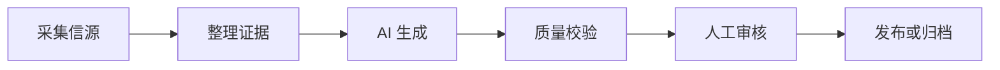

<div align="center">

# 熠觉 · Phosphene

### 把正在发生的事，变成有证据的表达

多信源采集 · 证据约束写作 · 人工审核 · 多格式生产 · 可追踪诊断

</div>

---

## 这是什么

熠觉 · Phosphene 是一套本地运行的 AI 内容生产系统。它从 API、RSS 和网页信源采集材料，把每条材料整理成带稳定编号的证据，再让 AI 只依据这些证据完成写作。

项目的目标不是“自动生成尽可能多的文章”，而是建立一条可以解释、复核和阻断的生产链：



默认内置 7 个内容分类：技术、财经、商业、娱乐、文学、国际和中医。每次生产可以输出中文博客、社交短文、Newsletter、视频脚本和英文版。

## 当前版本的重点

- 全新的“光谱编辑台”Web UI，而不是传统后台模板。
- 六阶段生产流水线与实时活动记录。
- 正文引用和采集证据联动的人工审核室。
- 引用格式自动归一化，但证据编号仍然严格校验。
- 审核通过时记录正文 SHA-256；审核后修改正文会自动失去部署资格。
- 发布前再次执行证据、质量、审核状态和正文指纹检查。
- Windows 控制台、系统代理、证书环境和 HTTP 客户端的详细诊断日志。
- 单信源失败隔离；代理环境异常时可自动回退到直连。
- Remotion 视频工作台与异步生成状态展示。

## 界面组成

### 今日生产

- 选择一个或多个分类。
- 查看采集、证据整理、生成、校验、审核和发布六个阶段。
- 查看当前使用的真实信源、有效证据数量和任务进度。
- WebSocket 实时显示简洁活动记录。

### 内容审核

- 区分待审核、需修改、已通过和旧版未验证内容。
- 文章引用可定位到右侧原始证据。
- 展示自动质量报告、无效引用、警告和审核意见。
- 只有通过严格校验的文章才能被人工批准。

### 内容档案

- 按分类、审核状态和标题搜索历史内容。
- 查看多格式内容、复制、下载、重新生成或生成视频。
- 显示证据数量、质量提醒和部署资格。

### 视频工作台

- 预览视频脚本和场景数量。
- 展示配音、Remotion 合成和 MP4 封装进度。
- 自动识别已有视频，避免每次进入页面都重新生成。
- 页面退出后会停止状态轮询，避免残留请求。

## 快速开始

### 运行环境

- Python 3.10 或更高版本，推荐 Python 3.11/3.12。
- Node.js 18 或更高版本，推荐 Node.js 20。
- Windows、macOS 或 Linux。
- 一个兼容 OpenAI API 协议的模型服务。

### 1. 安装 Python 依赖

Windows PowerShell：

```powershell
python -m venv .venv
.\.venv\Scripts\Activate.ps1
python -m pip install --upgrade pip
pip install -r requirements.txt
```

macOS / Linux：

```bash
python3 -m venv .venv
source .venv/bin/activate
python -m pip install --upgrade pip
pip install -r requirements.txt
```

### 2. 设置 API Key

不要把真实密钥写进 `config.yaml`。

PowerShell：

```powershell
$env:OPENAI_API_KEY="你的 API Key"
```

Windows CMD：

```bat
set OPENAI_API_KEY=你的 API Key
```

macOS / Linux：

```bash
export OPENAI_API_KEY="你的 API Key"
```

然后在 `config.yaml` 中设置对应的 `ai.base_url` 和 `ai.model`。

### 3. 构建前端

源码包已经包含构建后的 `web/static`，可以直接启动。如果修改了前端源码，再执行：

```bash
cd frontend
npm ci
npm run build
cd ..
```

### 4. 启动 Web UI

```bash
python main.py --serve
```

浏览器访问：

```text
http://127.0.0.1:5000
```

当前版本默认只允许监听本机地址。需要远程访问时，请使用带身份认证的反向代理或 SSH 隧道，不要直接暴露到公网。

## 常用命令

```bash
# 查看全部分类
python main.py --list-categories

# 运行技术分类
python main.py --category tech

# 使用 HTTP 直连，不启用 Scrapling 浏览器采集
python main.py --category tech --no-scrapling

# 启动定时轮询
python main.py --daemon

# 为已有文章生成视频
python main.py --generate-video tech 20260717_120000

# 部署已经人工审核且正文未发生变化的文章
python main.py --deploy
```

## 证据与引用规则

采集器会把每条有效材料转换成标准证据：

```text
证据编号：[github:1]
来源：GitHub
标题：项目标题
链接：https://github.com/...
时间：2026-07-17
摘要：...
```

正文中的规范引用格式为：

```markdown
这个项目在近期获得了较多关注。[github:1]
```

系统会兼容模型偶尔产生的以下格式：

```text
[证据github:1]
[证据 github:1]
[证据编号：github：1]
```

它们会被归一化成 `[github:1]`。归一化只修正外层格式，不会伪造证据，也不会把不存在的 `[github:99]` 变成有效引用。

质量门槛至少检查：

- 一级标题是否存在。
- `## 参考来源` 是否存在。
- 是否包含可点击的原始链接。
- 正文是否引用证据编号。
- 每个引用编号是否真实存在于本次采集结果。
- 财经和健康内容是否包含相应免责声明。
- 是否包含模型寒暄或绕过证据的表达。

## 人工审核与发布保护

新文章通过自动质量校验后，默认进入 `awaiting_review` 状态。

审核通过时系统会：

1. 再次归一化引用格式。
2. 重新运行严格质量校验。
3. 计算当前 `blog.md` 的 SHA-256。
4. 把指纹和审核状态写入 `metadata.json`。

如果审核后手工修改 `blog.md`，当前指纹与审核指纹不再一致，文章会显示“审核已失效”，部署命令也会跳过它。必须针对新内容重新审核。

## 详细诊断日志

Web 页面中的“流程记录”用于快速查看进度；完整排障信息写入：

```text
logs/phosphene-diagnostic.log
```

流程记录右上角的下载按钮可以直接导出该文件。后端接口为：

```text
GET /api/diagnostics/info
GET /api/diagnostics/log
```

日志使用 UTF-8 JSON Lines 格式，一行代表一个事件，便于人工阅读、搜索或交给其他模型分析：

```json
{
  "timestamp": "2026-07-17T18:30:30.125+08:00",
  "level": "ERROR",
  "event": "collector.source_failed",
  "run_id": "...",
  "category": "tech",
  "stage": "collect.source",
  "details": {
    "source": "github",
    "exception_type": "OSError",
    "errno": 22,
    "traceback": "..."
  }
}
```

### 日志会记录什么

- 每次任务的唯一 `run_id`、分类和当前流水线阶段。
- 操作系统、Python、事件循环及关键依赖版本。
- stdout/stderr 类型、编码、TTY 和文件描述符状态。
- 代理与证书环境变量是否存在、能否解析，但不记录原始值。
- HTTP 客户端初始化、是否使用系统环境、连接池和超时配置。
- 每个信源开始时间、适配器、目标域名和路径。
- HTTP 状态码、Content-Type、响应大小、跳转次数和耗时。
- 解析出的证据数量和失败信源汇总。
- AI、质量校验、多格式生成、保存、审核等待和发布阶段。
- 异常类型、`errno`、Windows `winerror` 和完整 Python traceback。

### 日志明确不会记录什么

- API Key、Bearer Token、Cookie、密码和代理凭据。
- URL 中的 token、签名和密钥查询参数。
- 采集到的响应正文。
- 完整 Prompt、AI 生成文章或用户内容。

即使异常文本里意外包含上述信息，写入前也会进行二次脱敏。

日志达到 10 MB 后自动滚动，默认保留 5 份历史文件。可以在 `config.yaml` 中调整：

```yaml
diagnostics:
  enabled: true
  directory: "./logs"
  filename: "phosphene-diagnostic.log"
  max_bytes: 10000000
  backup_count: 5
```

## `[Errno 22] Invalid argument` 排查方法

现在不要只看最后一行错误。下载诊断日志后搜索以下事件：

| 事件 | 含义 | 处理方向 |
|---|---|---|
| `console.write_failed` | Windows 控制台或 stdout 句柄不可用 | 控制台已降级为非关键输出，任务应继续 |
| `collector.http_client_init_failed` | HTTP 客户端初始化失败 | 检查代理、证书和网络配置 |
| `collector.http_client_fallback` | 系统环境失败，准备尝试直连 | 查看后续是否初始化成功 |
| `collector.source_failed` | 某个具体信源请求或解析失败 | 根据 `source` 和 traceback 修复适配器 |
| `collector.environment_fallback_started` | 检测到代理/环境类错误 | 系统会只重试失败的 HTTP 信源 |
| `collector.http_client_close_failed` | 连接池关闭异常 | 已采集证据不会因此丢失 |
| `pipeline.batch_failed` | 流水线最终失败 | 查看其中的阶段、错误码和完整 traceback |

本版本对该问题做了三层保护：

1. Rich 控制台输出失败不会再中断采集。
2. 单个信源出现 `OSError(22)` 只影响该信源。
3. 系统代理或证书环境疑似异常时，只针对失败的 HTTP 信源自动尝试直连。

## 网络配置

```yaml
network:
  timeout_seconds: 20
  max_connections: 8
  max_keepalive_connections: 4
  trust_env: true
  fallback_without_env: true
```

- `trust_env: true`：允许 httpx 读取 `HTTP_PROXY`、`HTTPS_PROXY`、`ALL_PROXY`、`NO_PROXY`、`SSL_CERT_FILE` 和 `SSL_CERT_DIR`。
- `fallback_without_env: true`：初始化或信源请求出现典型代理/环境错误时，自动尝试不继承这些环境变量的直连客户端。
- 如果确定不需要系统代理，可以把 `trust_env` 设为 `false`，获得更可预测的采集环境。

不要在 `config.yaml` 中保存带用户名和密码的代理地址。

## 主要配置

```yaml
ai:
  api_key: "${OPENAI_API_KEY}"
  base_url: "https://api.deepseek.com/v1"
  model: "deepseek-v4-flash"
  temperature: 0.8
  max_tokens: 4096

quality:
  min_evidence_items: 3
  require_human_review: true

runtime:
  concurrency: 2
  retry_count: 2
  debug: false
  scrapling: true

publish:
  mode: "local"
```

## 项目结构

```text
ai-blog-factory/
├── categories/                 # 7 个分类插件及信源配置
├── core/
│   ├── collector.py            # 证据采集、单信源隔离、环境回退
│   ├── diagnostics.py          # 结构化诊断、脱敏、滚动日志
│   ├── console.py              # 不影响主流程的安全控制台
│   ├── ai_client.py            # OpenAI 兼容模型客户端
│   ├── quality.py              # 引用归一化与确定性质量门槛
│   ├── output.py               # 原子化保存和索引生成
│   ├── publisher.py            # 本地/GitHub Pages 发布适配器
│   ├── runner.py               # CLI 流水线
│   └── task_store.py           # 持久化任务状态
├── web/
│   ├── routes/                 # 生产、档案、审核、视频、诊断 API
│   ├── static/                 # 已构建的前端资源
│   └── server.py               # FastAPI 与 SPA 路由
├── frontend/                   # React + TypeScript 光谱编辑台
├── remotion-video/             # Remotion 视频渲染工程
├── docs/posts/                 # 文章、证据元数据和视频产物
├── logs/                       # 运行时诊断日志，不进入版本控制
├── tests/                      # 核心逻辑和故障注入测试
├── config.yaml
└── main.py
```

## 添加新分类

在 `categories/` 下创建一个目录并实现 `BaseCategory`：

```python
from core.base_category import BaseCategory, CategoryInfo, SourceConfig


class MyCategory(BaseCategory):
    @property
    def info(self) -> CategoryInfo:
        return CategoryInfo(
            name="mycategory",
            display_name="我的分类",
            emoji="📌",
            description="这个分类追踪什么",
        )

    @property
    def sources(self) -> list[SourceConfig]:
        return [
            SourceConfig(
                name="source1",
                display_name="信源 1",
                type="rss",
                url="https://example.com/feed.xml",
            )
        ]
```

分类会被自动发现。新增信源时必须保证最终能得到标题和可追溯 URL；不能把未经整理的整页 HTML 直接交给模型。

## 开发与验证

安装开发依赖：

```bash
pip install -r requirements-dev.txt
```

运行检查：

```bash
pytest -q
ruff check core web main.py tests
python -m compileall -q core web main.py tests

cd frontend
npm ci
npm run build

cd ../remotion-video
npm ci
npm run lint
```

故障注入测试覆盖：

- 控制台写入抛出 `[Errno 22]` 时采集仍能完成。
- HTTP 客户端读取环境时初始化失败，自动回退到直连。
- 单信源请求抛出 `[Errno 22]`，只重试该 HTTP 信源。
- 日志包含完整 traceback、`errno` 和阶段上下文。
- API Key、URL token 和代理凭据不会出现在日志中。
- 诊断文件可以从 Web API 下载。
- 引用归一化后仍然严格校验证据 ID。
- 审核后修改正文会使部署资格失效。

## 安全边界

- Web 服务默认仅监听 `127.0.0.1`。
- API Key 只从环境变量读取。
- 采集内容被视为不可信数据，不允许覆盖系统写作规则。
- 证据不足时停止生成，不使用模型记忆补实时事实。
- 高风险分类必须包含免责声明并经过人工审核。
- GitHub Pages 发布只接受已审核、指纹一致且再次通过质量校验的文章。
- 诊断日志虽然已经脱敏，分享前仍建议确认其中是否包含不希望公开的本机路径或信源名称。

## 常见问题

### 点击生产后立即失败

先下载诊断日志，搜索本次 `run_id`。如果最早出现的是 `console.write_failed`，说明是终端句柄；如果是 `collector.http_client_init_failed`，检查系统代理和证书变量。

### 某些信源失败，但其他信源正常

这是允许的。系统会继续使用成功信源；只有有效证据低于 `quality.min_evidence_items` 时才会停止 AI 生成。

### 为什么技术分类切换 Scrapling 没变化

技术分类当前 5 个信源都是 API。Scrapling 开关主要影响财经、商业、文学、国际或中医分类中的网页信源。

### 为什么文章显示“审核已失效”

审核通过后 `blog.md` 被修改，正文指纹已经变化。重新打开审核室并针对新内容审核即可。

### 为什么部署命令没有发布全部文章

未审核、审核后被修改、证据缺失或重新校验失败的文章都会被主动跳过。

---

<div align="center">

**熠觉 · Phosphene**

信息如流，落笔为舟。

</div>
